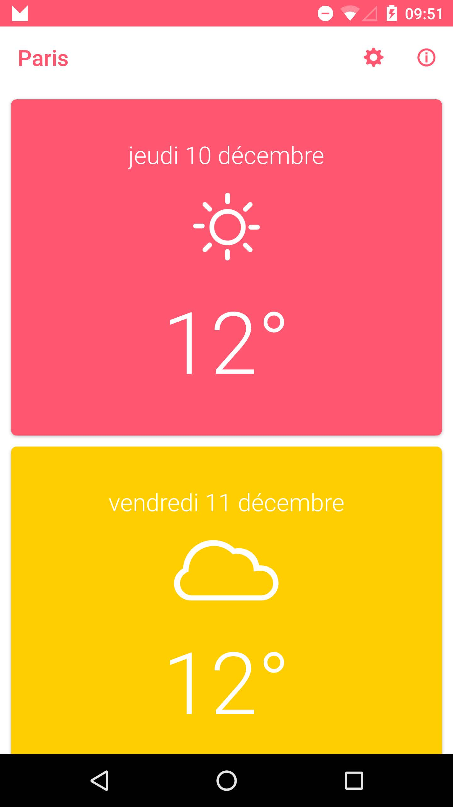
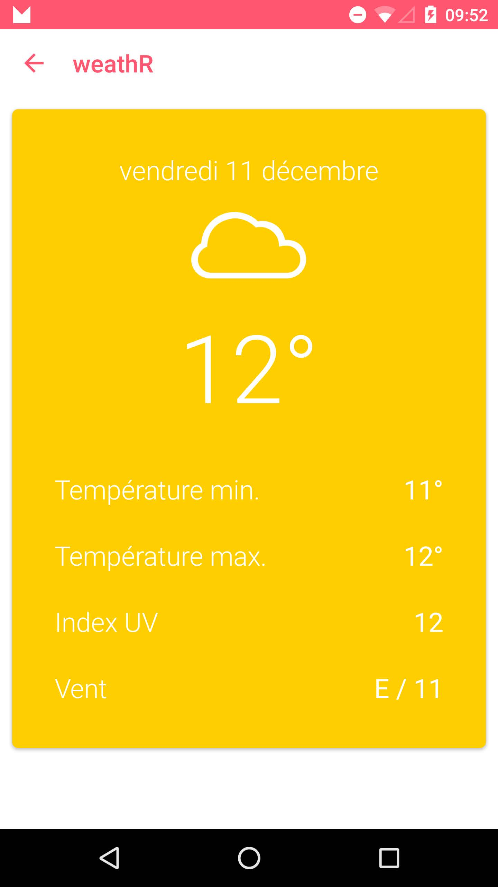
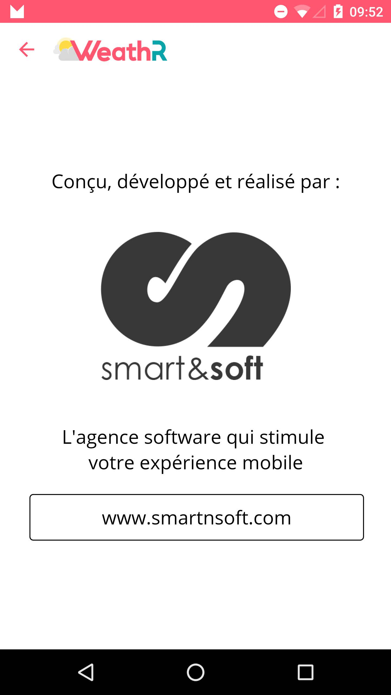

# weathR Android - Test CDI

Vous vous apprêtez à effectuer un test technique créé par Smart&amp;Soft.

## Avant de commencer

Assurez-vous que votre environnement est à jour avec les versions suivantes :

* SDK Android avec les versions 25 des derniers outils (SDK API 25, Build Tools 25.0.2, Support Library 25.3.0, etc.) ;
* Android Studio v2.3.x ;

Pour aborder le test sereinement, il convient également d'avoir :

* un compte GitHub ;
* un outil vous permettant une interaction avec un dépôt git et notamment les actions suivantes : clonage d'un dépôt, création d'une branche, commit, push et création de tag ;
* une téléphone et une tablette (7 pouces ou plus) sous Android 4.0.3 ou plus, ou à défaut un émulateur.

## Consignes

En cliquant sur le bouton ci-dessous, vous découvrirez le lien d'un dépôt git hébergé sur GitHub et vous disposerez d'une heure pour effectuer le test.

Ce dépôt contient deux choses :

* le code source Java d'une application Android développée sous Android Studio et qui vous servira de base pour effectuer ce test technique ;
* un fichier [INSTRUCTIONS.md](INSTRUCTIONS.md) qui contient les consignes de chacun des exercices qui vous seront demandés dans ce test technique.
* un fichier [COMMENTS.md](COMMENTS.md) dans lequel vous pourrez discuter de vos choix.

Cet entretien technique se composant de plusieurs questions / exercices, il convient donc de réaliser un seul commit par exercice afin de mettre en avant l'avancement du projet ainsi que le travail effectué en détail pour ceux-ci.

> Les exercices s'enchaînent de manière logique. Il convient donc, dans la mesure du possible, de les réaliser dans l'ordre dans lequel ils apparaissent dans les documents fournis.

À noter qu'il est possible de réaliser certaines de vos classes en Kotlin si vous le souhaitez. Cependant, gardez à l'esprit que les classes écrites en Java doivent le rester, et donc que le code à compléter au sein de ces classes doit l'être aussi.

## Présentation du projet

### Présentation fonctionnelle

weathR est une application simple permettant de connaître la météo fictive de trois grandes villes, à savoir Paris, Londres et Milan, sur les cinq à dix prochains jours.

Cette application se compose de 3 écrans :

* l'écran _home_ qui affiche sous la forme d'une liste les prévisions météo de la ville active ;
* l'écran _détail_ qui affiche de manière plus détaillée les prévisions météo d'une journée spécifique. On y accède en cliquant sur un item de la liste exposée par l'écran _home_ ;
* l'écran _about_, accessible depuis la barre d'action de la _home_, qui permet d'afficher quelques informations relatives à l'éditeur de l'application, à savoir Smart&amp;Soft.

Cette application se compose également d'un pop-up permettant de paramétrer la ville pour laquelle on souhaite connaitre la météo, ainsi que le nombre de jour à afficher (entre cinq et dix). Cette popup est accessible depuis la _home_ en cliquant sur la roue dentée depuis la barre d'action.

À noter que l'écran _home_ supporte une action de _swipe-to-refresh_ afin de forcer la refraîchissement de son contenu.

Les données de l'application sont récupérées depuis un service web.

### Maquettes

Pour mieux vous rendre compte du contenu de l'application, voici quelques captures d'écran :






### Présentation technique

#### Le service web

Comme précisé précédemment, les données permettant d'alimenter l'application sont issues d'un service web : [https://smartnsoft.com/shared/weather/index.php?city={city}&forecasts={forecasts}](https://smartnsoft.com/shared/weather/index.php?city=paris&forecasts=10).

Voici un example d'appel et du JSON retourné :

```
{
  "code": 200,
  "message": "OK",
  "city": "paris",
  "forecasts": [
    {
      "date": "2017-03-22",
      "temperatureMin": 3,
      "temperatureMax": 22,
      "type": "RAINY",
      "uvIndex": 3,
      "windDirection": "NE",
      "windSpeed": 22
    },
    {
      "date": "2017-03-23",
      "temperatureMin": 3,
      "temperatureMax": 23,
      "type": "SNOWY",
      "uvIndex": 3,
      "windDirection": "SE",
      "windSpeed": 23
    },
    {
      "date": "2017-03-24",
      "temperatureMin": 3,
      "temperatureMax": 24,
      "type": "STORMY",
      "uvIndex": 3,
      "windDirection": "N",
      "windSpeed": 24
    },
    {
      "date": "2017-03-25",
      "temperatureMin": 3,
      "temperatureMax": 25,
      "type": "SUNNY",
      "uvIndex": 3,
      "windDirection": "S",
      "windSpeed": 25
    },
    {
      "date": "2017-03-26",
      "temperatureMin": 3,
      "temperatureMax": 26,
      "type": "CLOUDY",
      "uvIndex": 3,
      "windDirection": "W",
      "windSpeed": 26
    },
    {
      "date": "2017-03-27",
      "temperatureMin": 3,
      "temperatureMax": 27,
      "type": "RAINY",
      "uvIndex": 3,
      "windDirection": "E",
      "windSpeed": 27
    },
    {
      "date": "2017-03-28",
      "temperatureMin": 3,
      "temperatureMax": 28,
      "type": "SNOWY",
      "uvIndex": 3,
      "windDirection": "NW",
      "windSpeed": 28
    },
    {
      "date": "2017-03-29",
      "temperatureMin": 3,
      "temperatureMax": 29,
      "type": "STORMY",
      "uvIndex": 3,
      "windDirection": "SW",
      "windSpeed": 29
    },
    {
      "date": "2017-03-30",
      "temperatureMin": 3,
      "temperatureMax": 30,
      "type": "SUNNY",
      "uvIndex": 3,
      "windDirection": "NE",
      "windSpeed": 30
    },
    {
      "date": "2017-03-31",
      "temperatureMin": 3,
      "temperatureMax": 31,
      "type": "CLOUDY",
      "uvIndex": 3,
      "windDirection": "SE",
      "windSpeed": 31
    }
  ]
}
```

#### Architecture de l'application Android

Le projet weathR est un projet Android Studio ne contenant qu'un seul module, nommé __app__ et correspondant à l'application Android.

En l'état actuel, le projet contient uniquement une activité et un fragment pour la page _about_ et les _assets_ et _resources_ nécessaires.
